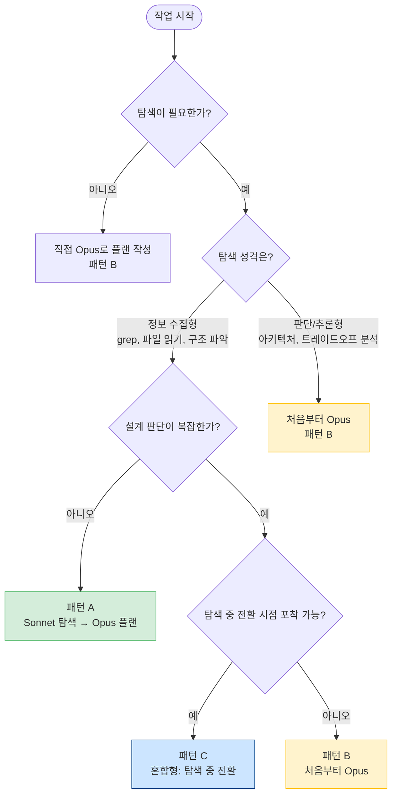
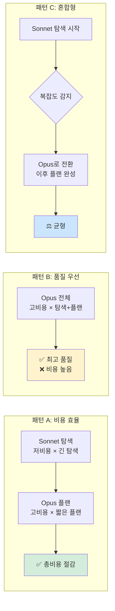
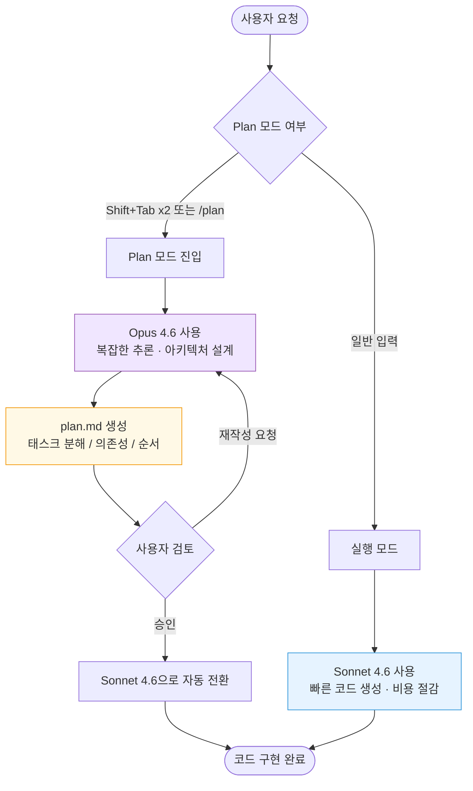

# opusplan 사용 패턴 가이드

> **한 줄 요약**: 탐색은 Sonnet으로, 플랜은 Opus로. 단, 설계가 복잡하면 처음부터 Opus.

---

> [!IMPORTANT]
> **Sonnet과 Opus의 차이는 "추론"에서만 발생한다**
>
> | 작업 유형 | Sonnet | Opus | 차이 |
> |-----------|--------|------|------|
> | 파일 읽기 / grep / 구조 파악 | ✅ 동일 | ✅ 동일 | **없음** |
> | 웹 검색 / 문서 조회 | ✅ 동일 | ✅ 동일 | **없음** |
> | 설계 판단 / 트레이드오프 분석 | 보통 | 강함 | **Opus 우위** |
> | 복잡한 플랜 수립 / 아키텍처 설계 | 보통 | 강함 | **Opus 우위** |
>
> 단순 탐색·정보 수집에 Opus를 쓰는 것은 **비용만 낭비**한다.
> Opus의 가치는 오직 **추론이 필요한 순간**에만 발휘된다.

---

## 1. 핵심 의사결정 다이어그램

### 작업 시작 전 패턴 선택 플로우차트



### 비용 효율 비교 도식



**비용 공식 (참고)**

```
패턴 A 비용 = Sonnet단가 × 탐색토큰 + Opus단가 × 플랜토큰
패턴 B 비용 = Opus단가 × (탐색토큰 + 플랜토큰)

절감율 ≈ (패턴B 비용 - 패턴A 비용) / 패턴B 비용 × 100%
     ≈ (Opus단가 - Sonnet단가) / Opus단가 × 탐색토큰 비율
```

> Opus 단가가 Sonnet 대비 약 5배이므로, 탐색이 전체의 50% 이상이면 패턴 A가 유리.

---

## 2. opusplan 사용 패턴 심화 분석

### 핵심 전제

> **플랜 품질은 탐색 품질에 종속된다.**

Opus가 아무리 뛰어나도, 입력(탐색 결과)이 빈약하면 플랜도 빈약해진다.
따라서 **어떤 모델로 탐색하느냐**보다 **탐색을 얼마나 충실히 하느냐**가 더 중요하다.

---

### 탐색 성격 분류

| 탐색 유형 | 설명 | 예시 | 권장 모델 |
|-----------|------|------|-----------|
| **정보 수집형** | 코드베이스에서 사실을 모으는 작업 | grep, 파일 읽기, 구조 파악, 의존성 확인 | Sonnet (비용 절감) |
| **판단/추론형** | 수집 결과를 해석하고 방향을 결정하는 작업 | 아키텍처 선택, 트레이드오프 분석, 리팩토링 전략 수립 | Opus (품질 우선) |

> 실제로 대부분의 탐색은 정보 수집형이다. 판단이 필요한 순간은 탐색 후반부 또는 플랜 단계에서 발생한다.

---

### 실전 패턴 3가지

#### 패턴 A: Sonnet 탐색 → Opus 플랜 (비용 효율)

**언제 사용**: 탐색이 주로 파일 읽기/grep 위주이고, 설계 판단은 플랜 단계에서 집중

**흐름**:
```
1. /model sonnet (또는 기본 모델로)
2. 코드베이스 탐색, 구조 파악, 관련 파일 수집
3. /model opusplan
4. 수집된 정보를 바탕으로 플랜 작성 요청
```

**적합한 경우**:
- 새 기능 추가 (기존 패턴 파악 후 적용)
- 버그 수정 (원인 파악 → 수정 전략)
- 리팩토링 (코드 이해 → 구조 설계)
- 대규모 레거시 코드 이해 후 개선

---

#### 패턴 B: 처음부터 Opus (설계 복잡)

**언제 사용**: 탐색 자체가 이미 판단과 분리하기 어려운 경우

**흐름**:
```
1. ANTHROPIC_MODEL=opusplan (영구 설정 권장)
2. 탐색과 플랜을 Opus가 통합적으로 처리
3. Plan 모드에서 plan.md 생성 → 승인 → Sonnet으로 구현
```

**적합한 경우**:
- 그린필드 프로젝트 설계
- 아키텍처 수준의 전면 재설계
- 여러 컴포넌트에 걸친 복잡한 리팩토링
- 보안 취약점 분석 및 대응 전략

---

#### 패턴 C: 혼합형 (탐색 중 전환)

**언제 사용**: Sonnet으로 탐색 시작했으나, 탐색 중 복잡도가 예상보다 높음을 인지

**흐름**:
```
1. /model sonnet 으로 시작
2. 탐색 중 "이건 단순 정보 수집이 아니네" 판단
3. /model opusplan 으로 전환
4. 이후 탐색 + 플랜을 Opus가 처리
```

**전환 신호**:
- 여러 시스템 간 복잡한 상호작용 발견
- 하위 호환성 문제 등 트레이드오프 발생
- 탐색 결과가 예상과 크게 다를 때

---

### 자가 체크리스트 (패턴 선택 전 5문항)

```
□ 1. 탐색 작업이 파일 읽기/grep 위주인가?           → 예: 패턴 A 고려
□ 2. 설계 판단이 탐색과 섞여서 나오는가?            → 예: 패턴 B 고려
□ 3. 전체 작업에서 탐색이 50% 이상인가?             → 예: 패턴 A로 비용 절감
□ 4. 탐색 중 복잡도가 갑자기 높아질 가능성이 있는가? → 예: 패턴 C 준비
□ 5. 최고 품질이 절대적으로 필요한가?               → 예: 패턴 B
```

---

### 작업 유형별 권고

| 작업 유형 | 권고 모델 | 이유 |
|-----------|-----------|------|
| 간단한 버그 수정 | `sonnet` | 오버스펙, 비용 낭비 |
| 반복 작업 (타입 추가, 리팩토링) | `sonnet` | 패턴이 명확하여 Sonnet으로 충분 |
| 새 API 엔드포인트 추가 | `opusplan` | 설계 검토 후 구현이 효율적 |
| 복잡한 아키텍처 설계 | `opusplan` 또는 `opus` | Opus의 깊은 추론 필요 |
| 설계는 꼼꼼히 + 구현은 빠르게 | **`opusplan`** | 하이브리드의 핵심 가치 |
| 비용 절감하면서 품질 유지 | **`opusplan`** | Plan 단계만 Opus 사용 |
| 다층 버그 디버깅 | `opus` 또는 `opusplan` | 근본 원인 분석에 Opus 추론 필요 |
| 대규모 레거시 코드 이해 | Sonnet 탐색 → `opusplan` | 탐색 비용 절감 |

---

## 3. Thinking 모드 설정 가이드

### 기본 권고

> **Thinking OFF로 토큰을 절약하고, 복잡한 플랜 작성 시에만 ON.**

Thinking 모드는 내부 추론을 위한 추가 토큰을 소비한다.
단순한 탐색이나 명확한 작업에는 불필요하므로 기본값을 OFF로 두는 것이 경제적이다.

---

### Thinking 제어 방법

| 방법 | 설명 | 범위 |
|------|------|------|
| `/config` → Thinking 토글 | 전역 기본값 설정. `~/.claude/settings.json`에 `alwaysThinkingEnabled` 저장 | 영구 (전역) |
| `Option+T` (Mac) / `Alt+T` (Linux) | 세션 중 즉시 토글 | 세션 한정 |
| `ultrathink` 키워드 | 프롬프트에 포함 시 해당 턴만 `effort=high`로 설정 (Opus/Sonnet 4.6) | 1턴 한정 |
| `MAX_THINKING_TOKENS=0` | 환경변수로 Thinking 완전 비활성화 (모든 모델) | 영구 (환경변수) |
| `/effort low` | effort 낮추면 Thinking 깊이도 감소 | 세션 한정 |

**주의사항**:
- `"think"`, `"think hard"`, `"think step by step"` 등 프롬프트 내 키워드는 **효과 없음** → 일반 텍스트로 처리됨
- `ultrathink`만 공식적으로 effort=high로 인식됨

---

### iTerm2에서 Option+T 사용 설정

터미널이 `Option` 키를 Meta 키로 전달하도록 설정해야 한다.

```
iTerm2 > Settings (⌘,) → Profiles → Keys → Left Option Key → Esc+
```

설정 후 새 터미널 창을 열면 `Option+T`로 Thinking 즉시 토글 가능.

---

### Thinking OFF/ON 장단점

| 구분 | Thinking OFF | Thinking ON |
|------|-------------|-------------|
| **토큰 비용** | 절감 | 추가 소비 |
| **응답 속도** | 빠름 | 느림 |
| **복잡한 추론** | 약함 | 강함 |
| **단순한 작업** | 충분 | 낭비 |
| **권장 상황** | 탐색, 파일 읽기, 단순 수정 | 아키텍처 설계, 복잡한 플랜, 트레이드오프 분석 |

---

## 4. opusplan 설정 방법

### opusplan 이란

`opusplan`은 Claude Code의 모델 alias다. Plan 모드에서는 Opus 4.6을, 실행 모드에서는 Sonnet 4.6을 자동으로 선택하는 하이브리드 설정이다.



---

### 모델 설정 영구화 (핵심)

> **`/model` 명령은 세션 한정이다. 영구 적용하려면 환경변수를 사용하라.**

| 설정 방법 | 지속성 | 우선순위 |
|-----------|--------|----------|
| `/model opusplan` 명령 | 세션 종료 시 초기화 | 낮음 |
| `--model opusplan` 플래그 | 해당 시작 시만 유효 | 중간 |
| `settings.json`의 `model` 필드 | 영구 | 중간 |
| `ANTHROPIC_MODEL=opusplan` 환경변수 | 영구 (셸 환경) | **높음** |

**권고**: `.zshrc` 또는 `.bashrc`에 아래 줄 추가

```bash
export ANTHROPIC_MODEL=opusplan
```

```bash
# 세션 중 전환
/model opusplan

# 시작 시 지정
claude --model opusplan
```

```json
// ~/.claude/settings.json
{ "model": "opusplan" }
```

---

### 모델 Alias 목록

| Alias | 동작 | 특징 |
|-------|------|------|
| `default` | 계정 플랜 기준 추천 모델 | - |
| `sonnet` | Sonnet 4.6 | 일상적 코딩, 비용 효율 |
| `opus` | Opus 4.6 | 복잡한 추론, 최고 품질 |
| `haiku` | Haiku 4.5 | 단순 작업, 최저 비용 |
| `sonnet[1m]` | Sonnet + 1M 컨텍스트 | 대규모 코드베이스 |
| `opusplan` | Plan → Opus, 실행 → Sonnet | **하이브리드** |

---

### 환경변수 전체 정리

| 환경변수 | 설명 | 예시 |
|----------|------|------|
| `ANTHROPIC_MODEL` | 기본 모델 설정 | `export ANTHROPIC_MODEL=opusplan` |
| `ANTHROPIC_DEFAULT_OPUS_MODEL` | opusplan의 Plan 모드 모델 지정 | `claude-opus-4-6` |
| `ANTHROPIC_DEFAULT_SONNET_MODEL` | opusplan의 실행 모드 모델 지정 | `claude-sonnet-4-6` |
| `ANTHROPIC_DEFAULT_HAIKU_MODEL` | 백그라운드 기능용 모델 | `claude-haiku-4-5` |
| `CLAUDE_CODE_SUBAGENT_MODEL` | 서브에이전트 모델 | - |
| `CLAUDE_CODE_EFFORT_LEVEL` | Opus 추론 수준 | `low` / `medium` / `high` |
| `MAX_THINKING_TOKENS` | Thinking 최대 토큰 (0=OFF) | `export MAX_THINKING_TOKENS=0` |
| `CLAUDE_CODE_DISABLE_ADAPTIVE_THINKING` | Adaptive reasoning 비활성화 | `export CLAUDE_CODE_DISABLE_ADAPTIVE_THINKING=1` |

---

### Effort Level 설정

추론 깊이 조절. 기본값은 `high`.

```bash
export CLAUDE_CODE_EFFORT_LEVEL=low    # 빠름·저비용
export CLAUDE_CODE_EFFORT_LEVEL=medium # 균형
export CLAUDE_CODE_EFFORT_LEVEL=high   # 기본값·깊은 추론
```

```json
// settings.json
{ "effortLevel": "medium" }
```

---

### Plan 모드 활성화/제약

**활성화**: `Shift+Tab` 두 번 또는 `/plan` (v2.1.0+)
**비활성화**: `Shift+Tab` 다시 입력

| 항목 | 가능 여부 |
|------|-----------|
| Read, Glob, Grep | ✅ 가능 |
| WebFetch, WebSearch | ✅ 가능 |
| TodoRead/Write, Task 생성 | ✅ 가능 |
| Edit, Write | ❌ 불가 |
| Bash | ❌ 불가 |
| 상태 변경 MCP 도구 | ❌ 불가 |

Plan 모드에서 Claude는 파일을 수정하거나 명령을 실행하지 않는다. 사용자가 plan.md를 검토하고 승인해야 실행 단계로 넘어간다.

---

### 1M 컨텍스트 윈도우

Opus 4.6과 Sonnet 4.6은 1M 토큰 컨텍스트를 지원한다. 200K 초과분부터 장문 컨텍스트 요금이 별도 적용된다.

```bash
/model sonnet[1m]
/model claude-sonnet-4-6[1m]
```

---

## 5. AI 참조용 요약

```yaml
KEY_FACTS:
  - opusplan은 claude-opus-4-6의 Plan 모드 특화 alias (Plan→Opus, 실행→Sonnet)
  - 플랜 품질은 탐색 품질에 종속됨
  - 정보 수집형 탐색은 Sonnet으로 비용 절감 가능
  - 영구 설정은 ANTHROPIC_MODEL 환경변수 권장
  - /model 명령은 세션 한정
  - Plan 모드 활성화: Shift+Tab 두 번 또는 /plan (v2.1.0+)
  - Plan 모드는 읽기 전용: Edit, Write, Bash 실행 불가
  - Effort Level은 Opus 4.6 전용: low/medium/high (기본값 high)
  - 1M 컨텍스트: sonnet[1m] / 200K 초과분 장문 요금 별도

USAGE_PATTERNS:
  pattern_a:
    name: "Sonnet 탐색 → Opus 플랜"
    when: "탐색이 파일 읽기/grep 위주, 탐색 비중 50% 이상"
    benefit: "비용 절감"
  pattern_b:
    name: "처음부터 Opus"
    when: "아키텍처 설계, 탐색과 판단이 분리 불가, 그린필드"
    benefit: "최고 품질"
  pattern_c:
    name: "혼합형"
    when: "탐색 중 복잡도 급상승 감지"
    benefit: "유연성"

THINKING_CONFIG:
  global_toggle: "/config → Thinking 토글 (alwaysThinkingEnabled in settings.json)"
  session_toggle: "Option+T (Mac) / Alt+T"
  single_turn_high: "ultrathink 키워드 (Opus/Sonnet 4.6)"
  disable_all: "MAX_THINKING_TOKENS=0"
  reduce_depth: "/effort low"
  ineffective_keywords:
    - "think"
    - "think hard"
    - "think step by step"
  note: "위 키워드들은 일반 프롬프트로 처리됨. ultrathink만 공식 지원"
```
