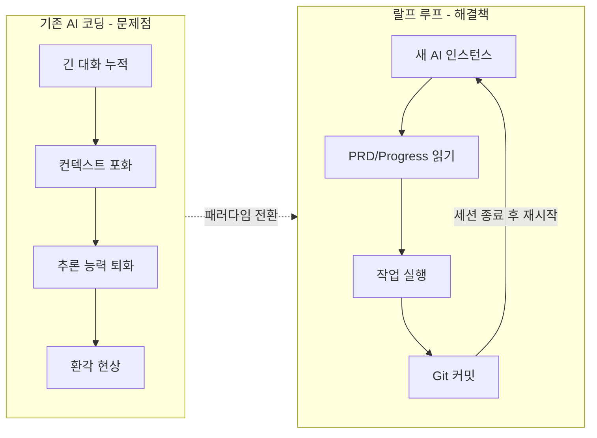
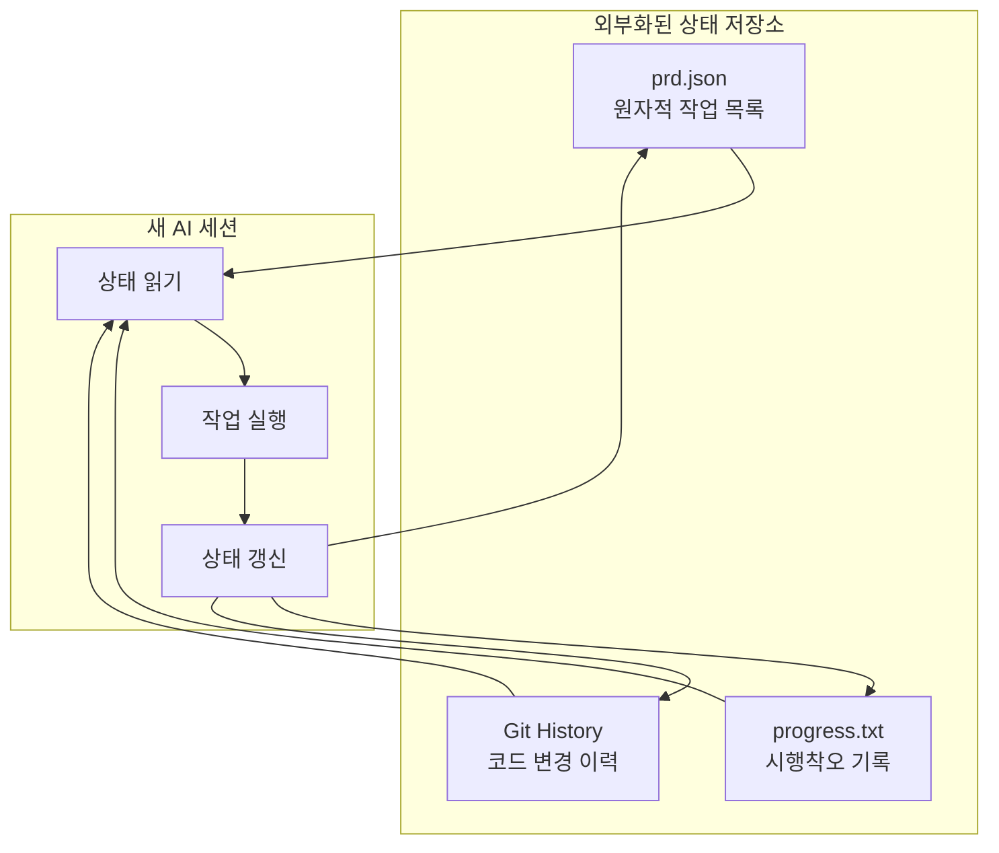
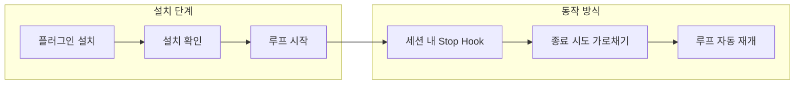
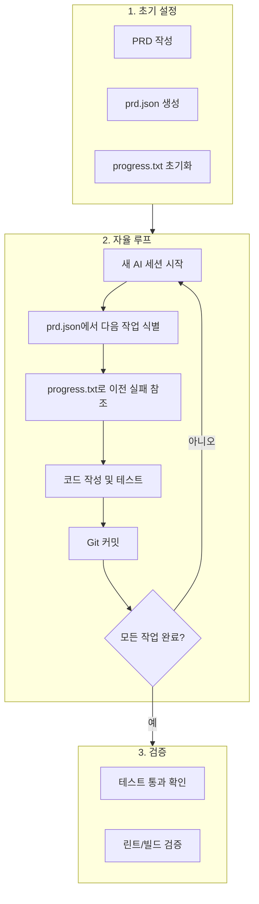
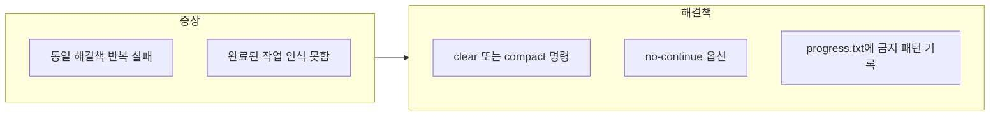
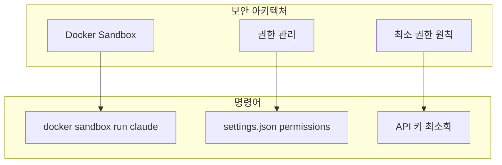

# 랄프 루프(Ralph Loop) 설치 가이드

Claude Code에서 자율형 AI 코딩을 위한 **랄프 루프** 설치 및 운용 가이드입니다.

---

## 1. 핵심 개념



| 구분 | 기존 방식 | 랄프 루프 |
|------|----------|----------|
| **컨텍스트** | 누적되어 오염 | 매번 새로 시작 |
| **메모리** | 대화 이력 의존 | 파일 시스템 + Git |
| **안정성** | 장시간 작업 시 퇴화 | 일관된 품질 유지 |

> **핵심 철학**: "LLM은 자신의 과제를 스스로 채점하는 능력이 부족하다" - 외부 검증 루프 필수

---

## 2. Persistence 매커니즘



| 컴포넌트 | 파일 형식 | 역할 |
|---------|----------|------|
| **PRD** | `prd.json` | 원자적 작업 목록 및 완료 상태 관리 |
| **Progress Log** | `progress.txt` | 이전 루프의 패턴, 시행착오, 특이사항 기록 |
| **Git History** | Git Repo | 실제 코드 변경 사항 및 커밋 메시지 보존 |

---

## 3. 설치 방법: Anthropic 공식 플러그인



**설치 및 사용:**

```bash
# Claude Code 터미널에서 실행

# 1. 플러그인 설치
/plugin install ralph-wiggum@claude-plugins-official

# 2. 설치 확인 (Tab 자동완성)
/ralph [Tab]

# 3. 루프 시작
/ralph-loop "작업 내용" --completion-promise "완료 신호" --max-iterations 20
```

**주요 옵션:**

| 옵션 | 설명 | 예시 |
|-----|------|------|
| `--completion-promise` | 완료 조건 신호 | `"모든 테스트 통과"` |
| `--max-iterations` | 최대 반복 횟수 | `20` |

> **참고**: 단일 컨텍스트 윈도우 내에서 동작하므로 단기/명확한 작업에 적합

---

## 4. 전체 워크플로우



---

## 5. 트러블슈팅

### 컨텍스트 오염 증상



| 해결책 | 명령어/방법 | 설명 |
|-------|-----------|------|
| **수동 초기화** | `/clear` 또는 `/compact` | 컨텍스트 초기화/요약 |
| **강제 신규 세션** | `--no-continue` | 이전 세션 ID 공유 안 함 |
| **명시적 가이드** | progress.txt 수정 | "방법 X는 Y 오류 발생, 사용 금지" 기록 |

---

## 6. 비용 관리

| 전략 | 설정 | 효과 |
|-----|------|------|
| **반복 횟수 제한** | `max-iterations: 10~20` | 초기 테스트 시 토큰 절약 |
| **모델 혼합** | 단순 작업: Haiku, 복잡 작업: Sonnet | 비용 대비 효율 최적화 |

---

## 7. 보안 권장사항



> **필수**: `--dangerously-skip-permissions` 사용 시 반드시 Docker 샌드박스 내에서 실행
