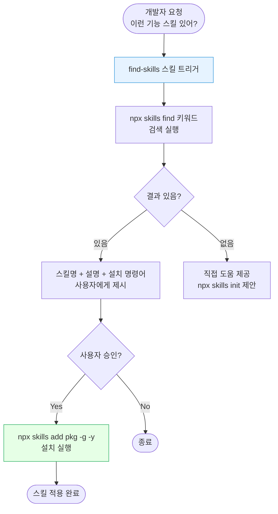
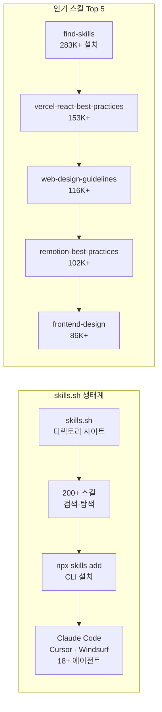

# skills.sh & find-skills 가이드

> AI 에이전트용 스킬 생태계 디렉토리와 스킬 검색·설치 방법

---

## 개요 (사람용 다이어그램)





---

## 상세 내용

### skills.sh 란

skills.sh는 AI 에이전트용 재사용 가능한 스킬의 오픈 생태계 디렉토리다. 2026년 1월 20일 Vercel이 런칭했으며, 단일 명령어로 에이전트에 전문 지식을 추가할 수 있다.

주요 특징:
- 200개 이상의 스킬 제공
- Claude Code, Cursor, Windsurf, GitHub Copilot, Cline 등 **18개 이상** AI 에이전트 지원
- Vercel, Anthropic, Microsoft, Supabase 등 주요 기업이 스킬 기여
- 익명 텔레메트리 기반 설치 통계 (개인정보 미수집)

---

### find-skills 스킬

**find-skills**는 skills.sh 생태계에서 스킬을 **발견하고 설치**하는 메타 스킬이다. 283K+ 설치로 전체 1위를 차지하고 있다.

제공: `vercel-labs/skills`

#### 트리거 조건

다음 상황에서 find-skills가 자동으로 작동한다:

| 사용자 발화 패턴 | 예시 |
|----------------|------|
| `"X 하는 방법이 있어?"` | "PR 리뷰 자동화하는 스킬 있어?" |
| `"X 스킬 찾아줘"` | "React 성능 최적화 스킬 찾아줘" |
| `"X 할 수 있어?"` | "Playwright 테스트 작성 도와줄 수 있어?" |
| 특정 도메인 언급 | 디자인, 테스트, 배포, 문서화 등 |
| 에이전트 능력 확장 요청 | "기능을 추가하고 싶어" |

#### 동작 4단계

```
1. 요구사항 파악   → 도메인, 작업, 스킬 존재 가능성 판단
2. 검색 실행      → npx skills find [키워드]
3. 결과 제시      → 스킬명 + 설명 + 설치 명령어 + skills.sh 링크
4. 설치           → 사용자 승인 시 npx skills add <패키지> -g -y
```

#### 폴백 처리

검색 결과가 없으면:
1. 직접 도움 제공 (스킬 없이 작업 수행)
2. `npx skills init`으로 새 스킬 생성 제안

---

### CLI 명령어

#### 스킬 설치

```bash
# 기본 설치
npx skills add <owner>/<repo>

# 특정 스킬만 설치
npx skills add vercel-labs/agent-skills --skill find-skills

# 전역 설치 + 확인 생략
npx skills add vercel-labs/agent-skills -g -y

# 특정 에이전트에 설치
npx skills add vercel-labs/agent-skills -a claude-code

# 저장소의 모든 스킬을 모든 에이전트에 설치
npx skills add vercel-labs/agent-skills --all

# 저장소 내 스킬 목록 확인
npx skills add vercel-labs/agent-skills --list
```

#### 스킬 검색

```bash
# 키워드로 검색
npx skills find react
npx skills find pr-review
npx skills find "react performance"
```

#### 스킬 관리

```bash
# 업데이트 확인
npx skills check

# 전체 스킬 업데이트
npx skills update

# 새 스킬 초기화 (직접 제작)
npx skills init
```

#### 텔레메트리 비활성화

```bash
DISABLE_TELEMETRY=1 npx skills add vercel-labs/agent-skills
```

---

### 주요 스킬 카탈로그

| 순위 | 스킬 | 제공자 | 설명 | 설치 수 |
|------|------|--------|------|---------|
| 1 | find-skills | vercel-labs/skills | 스킬 검색·설치 메타 스킬 | 283K+ |
| 2 | vercel-react-best-practices | vercel-labs/agent-skills | React 베스트 프랙티스 | 153K+ |
| 3 | web-design-guidelines | vercel-labs/agent-skills | 웹 디자인 가이드라인 | 116K+ |
| 4 | remotion-best-practices | remotion-dev/skills | Remotion 영상 제작 | 102K+ |
| 5 | frontend-design | anthropics/skills | 프론트엔드 UI 설계 | 86K+ |

스킬 카테고리:
- 웹 개발: react, nextjs, typescript
- 테스트: jest, playwright, e2e
- DevOps: deploy, docker, kubernetes
- 문서화: docs, readme, changelog
- 코드 품질: lint, refactor, review
- 디자인: ui, ux, accessibility

---

### Claude Code에서 find-skills 설치

```bash
# find-skills 스킬 설치
npx skills add https://github.com/vercel-labs/skills --skill find-skills

# 또는 vercel-labs 전체 스킬 설치
npx skills add vercel-labs/agent-skills -g -y
```

설치 후 Claude Code에서 스킬 탐색:
```
사용자: "Playwright 자동화 스킬 있어?"
→ find-skills가 자동 트리거
→ npx skills find playwright 실행
→ 관련 스킬 목록 제시
→ 승인 시 자동 설치
```

---

### skills.sh vs skillsmp.com 비교

| 항목 | skills.sh | skillsmp.com |
|------|-----------|--------------|
| 주체 | Vercel Labs | 커뮤니티 |
| 런칭 | 2026년 1월 | 기존 운영 |
| CLI | npx skills | 없음 (수동 설치) |
| 에이전트 지원 | 18개+ | Claude Code 중심 |
| 설치 통계 | 실시간 제공 | 미제공 |
| 스킬 수 | 200+ | 다수 |

---

## AI 참조용 요약

TOPIC: skills.sh and find-skills skill for Claude Code
CATEGORY: skill-management, agent-ecosystem, tool-discovery

KEY_FACTS:
- skills.sh는 Vercel이 2026년 1월 20일 런칭한 AI 에이전트용 오픈 스킬 생태계 디렉토리다
- CLI: npx skills add <owner>/<repo> 형식으로 설치
- 18개 이상의 AI 에이전트 지원: Claude Code, Cursor, Windsurf, GitHub Copilot 등
- find-skills는 스킬 검색·설치 메타 스킬로 283K+ 설치로 전체 1위
- find-skills 설치: npx skills add https://github.com/vercel-labs/skills --skill find-skills

FIND_SKILLS_TRIGGERS:
- "X 하는 스킬 있어?" 형태의 질문
- "find a skill for X" 요청
- 특정 도메인 능력 확장 요청
- 스킬 설치 후 실행 프로세스: 검색 → 제시 → 승인 → 설치

CLI_COMMANDS:
- npx skills add <owner/repo> : 스킬 설치
- npx skills add <pkg> --skill <name> : 특정 스킬만 설치
- npx skills add <pkg> -g -y : 전역+자동승인
- npx skills add <pkg> -a claude-code : 특정 에이전트에 설치
- npx skills add <pkg> --all : 모든 에이전트에 설치
- npx skills add <pkg> --list : 저장소 스킬 목록
- npx skills find <query> : 키워드 검색
- npx skills check : 업데이트 확인
- npx skills update : 전체 업데이트
- npx skills init : 새 스킬 제작 초기화
- DISABLE_TELEMETRY=1 : 텔레메트리 비활성화

TOP_SKILLS:
- find-skills (283K): vercel-labs/skills
- vercel-react-best-practices (153K): vercel-labs/agent-skills
- web-design-guidelines (116K): vercel-labs/agent-skills
- remotion-best-practices (102K): remotion-dev/skills
- frontend-design (86K): anthropics/skills

REFERENCES:
- https://skills.sh/
- https://skills.sh/vercel-labs/skills/find-skills
- https://github.com/vercel-labs/skills
- https://skills.sh/docs/cli
