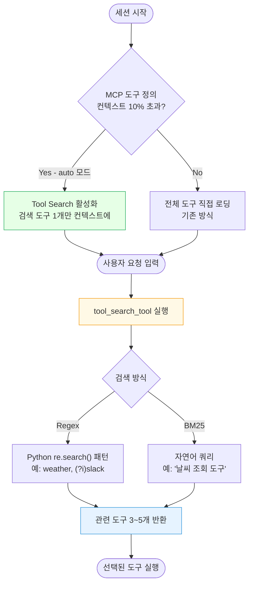
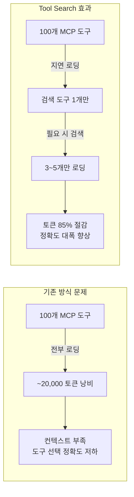

# MCP Tool Search 가이드

> MCP 도구가 많을 때 컨텍스트 윈도우를 절약하는 동적 도구 로딩 메커니즘

---

## 개요 (사람용 다이어그램)





---

## 상세 내용

### 문제: MCP 도구가 많으면 컨텍스트가 폭발한다

MCP 서버를 여러 개 연결하면 모든 도구 정의가 세션 시작 시 컨텍스트에 통째로 올라간다.

실제 사례:
- 개발자 Scott Spence: 세션 시작 직후 토큰 66,000개 소진 (아무것도 안 했는데)
- Palantir MCP: 도구 정의만 37,000+ 토큰 차지
- 50개 도구 ≈ 10,000~20,000 토큰 낭비

문제 두 가지:
1. 컨텍스트 낭비: 실제 작업에 쓸 수 있는 공간이 줄어든다
2. 도구 선택 정확도 저하: 30~50개 이상이 되면 Claude의 선택 성능이 급격히 떨어진다

### 성능 효과

| 지표 | 개선 |
|------|------|
| 토큰 오버헤드 | **85% 감소** |
| Opus 4 도구 선택 정확도 | 49% → **74%** |
| Opus 4.5 도구 선택 정확도 | 79.5% → **88.1%** |

### Claude Code에서의 동작

자동 활성화: MCP 도구 정의가 컨텍스트의 10%를 초과하면 Tool Search 자동 활성화

```bash
ENABLE_TOOL_SEARCH=auto        # 기본값 (10% 초과 시 자동)
ENABLE_TOOL_SEARCH=auto:5      # 5% 초과 시 활성화
ENABLE_TOOL_SEARCH=true        # 항상 활성화
ENABLE_TOOL_SEARCH=false       # 비활성화 (전체 도구 미리 로딩)
```

```json
// settings.json으로 MCPSearch 도구 비활성화
{
  "permissions": {
    "deny": ["MCPSearch"]
  }
}
```

지원 모델: Sonnet 4.0 이상, Opus 4.0 이상. Haiku는 지원하지 않는다.

### 내부 동작 흐름

1. Claude 세션 시작 → MCP 도구들 "deferred" 상태 (컨텍스트에 미로딩)
2. 사용자 요청 입력 ("슬랙에 메시지 보내줘")
3. Claude가 tool_search_tool로 검색 (검색어: "slack")
4. 결과: [slack_send_message, slack_read_channel, slack_search] 반환
5. 반환된 3~5개 도구 정의만 컨텍스트에 로딩
6. Claude가 적절한 도구 선택 및 실행

### API 직접 사용 (개발자용)

검색 방식 두 가지:
- Regex: `tool_search_tool_regex_20251119` — Python regex 패턴
- BM25: `tool_search_tool_bm25_20251119` — 자연어 쿼리

```python
import anthropic

client = anthropic.Anthropic()
response = client.messages.create(
    model="claude-opus-4-6",
    max_tokens=2048,
    messages=[{"role": "user", "content": "날씨 알려줘"}],
    tools=[
        # 검색 도구: defer_loading 없음 (항상 활성)
        {"type": "tool_search_tool_regex_20251119", "name": "tool_search_tool_regex"},
        # 실제 도구: defer_loading: True (지연 로딩)
        {
            "name": "get_weather",
            "description": "특정 위치의 현재 날씨를 조회합니다",
            "input_schema": {
                "type": "object",
                "properties": {
                    "location": {"type": "string"},
                    "unit": {"type": "string", "enum": ["celsius", "fahrenheit"]}
                },
                "required": ["location"]
            },
            "defer_loading": True,
        },
    ],
)
```

MCP 서버와 함께 사용 (Beta 헤더 필요):

```python
response = client.beta.messages.create(
    model="claude-opus-4-6",
    betas=["mcp-client-2025-11-20"],
    mcp_servers=[{"type": "url", "name": "db", "url": "https://mcp-db.example.com"}],
    tools=[
        {"type": "tool_search_tool_regex_20251119", "name": "tool_search_tool_regex"},
        {
            "type": "mcp_toolset",
            "mcp_server_name": "db",
            "default_config": {"defer_loading": True},     # 전체 기본값
            "configs": {"search_events": {"defer_loading": False}}  # 특정 도구 즉시 로딩
        }
    ],
    messages=[{"role": "user", "content": "DB 이벤트 조회"}],
)
```

### Regex 패턴 예시

```
"weather"                           # 포함 검색
"get_.*_data"                       # get_user_data, get_weather_data 등
"database.*query|query.*database"   # OR 패턴
"(?i)slack"                         # 대소문자 무시
```

주의: 자연어가 아닌 Python `re.search()` 정규식. 패턴 최대 200자.

### 에러 처리

```json
// 모든 도구에 defer_loading 설정 시 (400)
{ "message": "All tools have defer_loading set. At least one tool must be non-deferred." }

// tool_reference 대상 도구 정의 없을 시 (400)
{ "message": "Tool reference 'unknown_tool' has no corresponding tool definition" }
```

에러 코드: `too_many_requests`, `invalid_pattern`, `pattern_too_long`, `unavailable`

### 언제 써야 할까

Tool Search가 유용한 경우:
- MCP 도구가 10개 이상
- 도구 정의가 10,000 토큰 이상 차지
- 여러 MCP 서버 연결 (200개 이상 도구)

기존 방식이 나을 수도 있는 경우:
- 전체 도구가 10개 미만
- 모든 요청에서 모든 도구를 항상 사용
- 도구 정의 합계가 100 토큰 미만

### MCP 서버 제작 시 팁

Tool Search 환경에서는 서버 instructions 필드가 중요하다. Claude가 언제 내 서버 도구를 검색해야 하는지 명확히 작성한다.

```json
{
  "instructions": "슬랙 메시지 전송, 채널 조회, 사용자 검색 등 Slack 관련 작업에 이 서버의 도구를 사용하세요."
}
```

도구 이름과 설명에 검색 키워드를 충분히 포함시켜야 Claude가 찾을 수 있다.

### 제약사항

| 항목 | 제한 |
|------|------|
| 최대 도구 수 | 10,000개 |
| 검색당 반환 결과 | 3~5개 |
| Regex 패턴 최대 길이 | 200자 |
| 지원 모델 | Sonnet 4.0+, Opus 4.0+ (Haiku 불가) |
| ZDR | 서버사이드 Tool Search는 ZDR 미적용 |

---

## AI 참조용 요약

TOPIC: MCP Tool Search (Deferred Tool Loading) in Claude Code
CATEGORY: mcp, context-optimization, tool-management

KEY_FACTS:
- MCP Tool Search는 MCP 도구를 필요할 때만 로딩하는 지연 로딩 메커니즘이다
- Claude Code는 MCP 도구 정의가 컨텍스트의 10%를 초과하면 자동으로 활성화한다
- 도구에 defer_loading: true를 설정하면 지연 로딩 대상이 된다
- 검색 도구 자체(tool_search_tool_*)에는 defer_loading을 설정하지 않는다
- 검색 방식: Regex(tool_search_tool_regex_20251119) 또는 BM25(tool_search_tool_bm25_20251119)
- 검색당 3~5개 도구를 반환한다
- 지원 모델: Sonnet 4.0 이상, Opus 4.0 이상 (Haiku 불가)
- 최대 10,000개 도구를 카탈로그에 등록 가능

PERFORMANCE:
- 토큰 오버헤드 85% 감소
- Opus 4 정확도: 49% → 74%
- Opus 4.5 정확도: 79.5% → 88.1%

CONTROL:
- ENABLE_TOOL_SEARCH=auto (기본, 10% 초과 시 활성)
- ENABLE_TOOL_SEARCH=auto:N (N% 임계값 커스텀)
- ENABLE_TOOL_SEARCH=true (항상 활성)
- ENABLE_TOOL_SEARCH=false (비활성)
- settings.json의 permissions.deny에 "MCPSearch" 추가로 비활성화 가능

MCP_SERVER_INTEGRATION:
- beta 헤더 "mcp-client-2025-11-20" 필요
- mcp_toolset의 default_config.defer_loading으로 서버 전체 도구 지연 설정
- configs 필드로 특정 도구만 즉시 로딩 가능

ERROR_CODES:
- 모든 도구에 defer_loading 설정 시 400 에러
- tool_reference 대상 도구 정의 없을 시 400 에러
- 실행 중: too_many_requests, invalid_pattern, pattern_too_long, unavailable

REFERENCES:
- https://platform.claude.com/docs/en/agents-and-tools/tool-use/tool-search-tool
- https://code.claude.com/docs/en/mcp
- https://github.com/anthropics/claude-code/issues/12836
