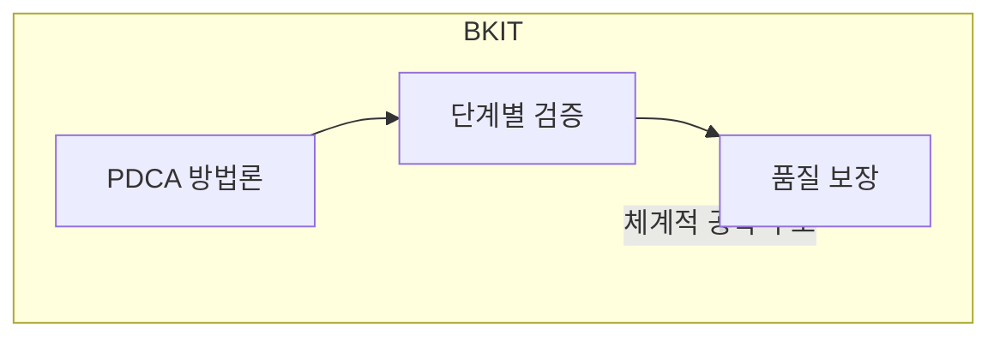
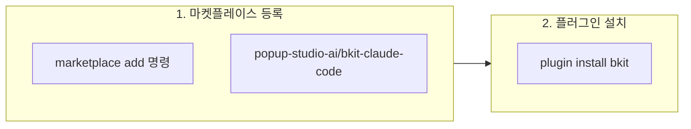
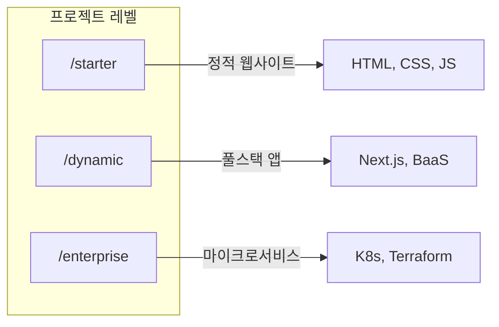
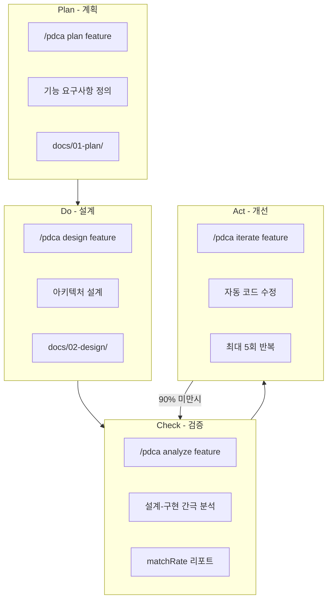
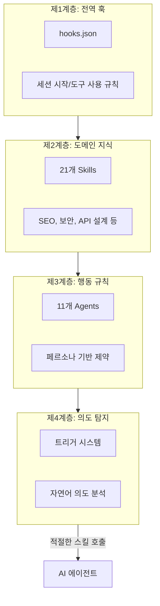
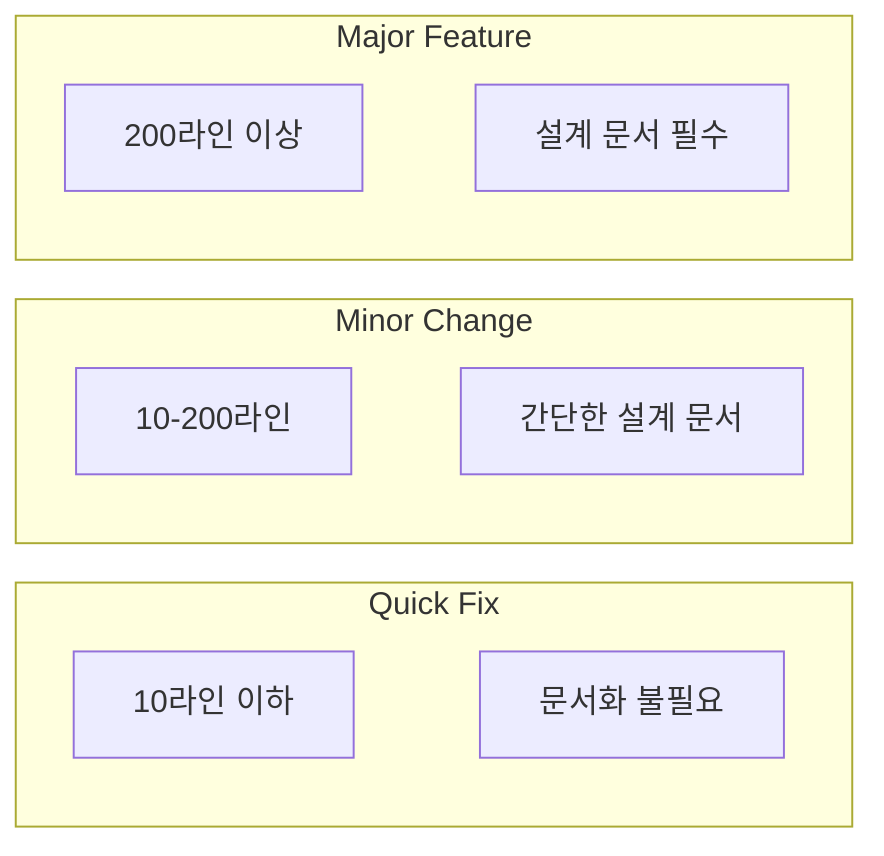
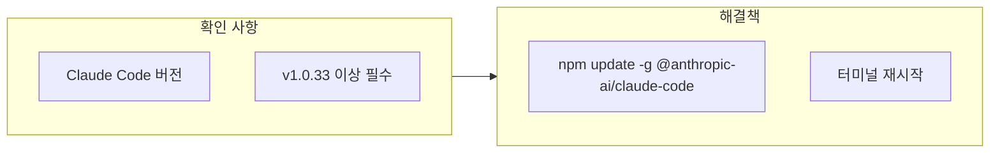

# BKIT(Vibecoding Kit) 설치 가이드

Claude Code에서 **PDCA 기반 체계적 자율 개발**을 위한 BKIT 설치 및 운용 가이드입니다.

**공식 사이트:**
- GitHub: https://github.com/popup-studio-ai/bkit-claude-code
- 홈페이지: https://www.bkit.ai/

---

## 1. 핵심 개념



| 구분 | 설명 |
|------|------|
| **철학** | 체계적 공학 구조 |
| **방법론** | PDCA 사이클 |
| **강점** | 품질 보장, 설계 일관성 |

> **BKIT 구성**: 21개 스킬 + 11개 에이전트 + 39개 스크립트 + 132개 유틸리티 함수

---

## 2. Claude Code 설치



**설치 명령어:**

```bash
# Claude Code 터미널에서 실행

# 1. 마켓플레이스 추가
/plugin marketplace add popup-studio-ai/bkit-claude-code

# 2. 핵심 모듈 설치 (프로젝트 로컬 설치)
/plugin install bkit --project
```

> **주의: 전역 설치 금지**
> 
> `--project` 옵션 없이 전역 설치하면 **모든 프로젝트에서 Claude 실행 시 bkit 관련 파일이 자동 생성**되는 문제가 발생합니다.
> 반드시 `--project` 옵션을 사용하여 해당 프로젝트에만 설치하세요.

---

## 3. 프로젝트 초기화 명령어



| 명령어 | 레벨 | 설명 | 기술 스택 |
|-------|------|------|----------|
| `/starter` | Starter | 정적 웹사이트, 포트폴리오 | HTML, CSS, JS |
| `/dynamic` | Dynamic | 풀스택 애플리케이션 | Next.js, BaaS |
| `/enterprise` | Enterprise | 마이크로서비스 아키텍처 | K8s, Terraform, MSA |

---

## 4. PDCA 워크플로우 명령어



### 핵심 PDCA 명령어

| 명령어 | 단계 | 기능 | 산출물 |
|-------|------|------|--------|
| `/pdca plan {feature}` | Plan | 기능 요구사항 정의 | `docs/01-plan/*.md` |
| `/pdca design {feature}` | Do | 아키텍처/데이터 모델/API 설계 | `docs/02-design/*.md` |
| `/pdca do {feature}` | Do | 구현 가이드 | 소스 코드 |
| `/pdca analyze {feature}` | Check | 설계-구현 간극 분석 | matchRate 갭 리포트 |
| `/pdca iterate {feature}` | Act | 분석 기반 자동 수정 | 최대 5회 반복 (90% 임계값) |
| `/pdca report {feature}` | - | 완료 보고서 생성 | 최종 리포트 |
| `/pdca status` | - | 현재 PDCA 상태 확인 | 상태 정보 |
| `/pdca next` | - | 다음 PDCA 단계 안내 | 가이드 |

### PDCA 실행 예시

```bash
# 1. 계획 수립
/pdca plan 사용자 인증 기능

# 2. 설계 문서 작성
/pdca design 사용자 인증 기능

# 3. 구현 가이드
/pdca do 사용자 인증 기능

# 4. 간극 분석 (설계 vs 구현)
/pdca analyze 사용자 인증 기능

# 5. 자동 수정 반복 (matchRate 90% 이상까지)
/pdca iterate 사용자 인증 기능

# 6. 완료 보고서
/pdca report 사용자 인증 기능
```

---

## 5. 기타 유용한 명령어

| 명령어 | 기능 |
|-------|------|
| `/claude-code-learning` | Claude Code 학습 시작 |
| `/zeroscript qa` | 로그 분석 기반 자동화 테스트 |

---

## 6. 4계층 컨텍스트 엔지니어링



| 계층 | 구성 요소 | 역할 |
|-----|----------|------|
| **제1계층** | hooks.json | 세션 시작, 도구 사용 전후 규칙 강제 |
| **제2계층** | 21개 Skills | 원자적 도메인 전문성 주입 |
| **제3계층** | 11개 Agents | 페르소나 기반 제약 및 모델 선택 |
| **제4계층** | 트리거 시스템 | 사용자 의도 분석 및 스킬 호출 |

---

## 7. 작업 규모별 자동 제어



---

## 8. 트러블슈팅

### 플러그인 로드 실패



### Windows 호환성

| 버전 | 문제 | 해결 |
|-----|------|------|
| v1.4.3 이전 | .sh 실행 오류 | 최신 버전 업데이트 |
| v1.4.4 이상 | 노드 기반 통일 | hooks.json에서 `node` 접두사 확인 |

### 마켓플레이스 접근 불가

1. 네트워크 도메인 차단 여부 확인
2. 프라이빗 저장소: Git 인증 토큰 설정 확인

---

## 9. 다국어 지원

BKIT은 트리거 키워드를 통해 자동으로 언어를 감지합니다.

| 언어 | 트리거 키워드 예시 |
|-----|------------------|
| English | static website, beginner, API design |
| Korean | 정적 웹, 초보자, API 설계 |
| Japanese | 静的サイト, 初心者, API設計 |
| Chinese | 静态网站, 初学者, API设计 |
| Spanish | sitio web estático, principiante |
| French | site web statique, débutant |
| German | statische Webseite, Anfänger |
| Italian | sito web statico, principiante |
