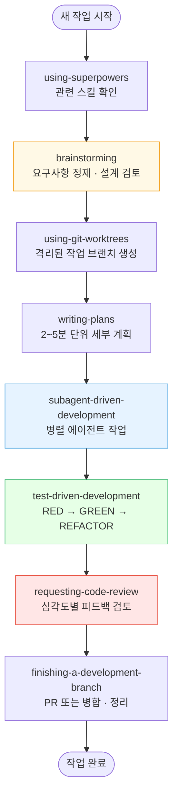
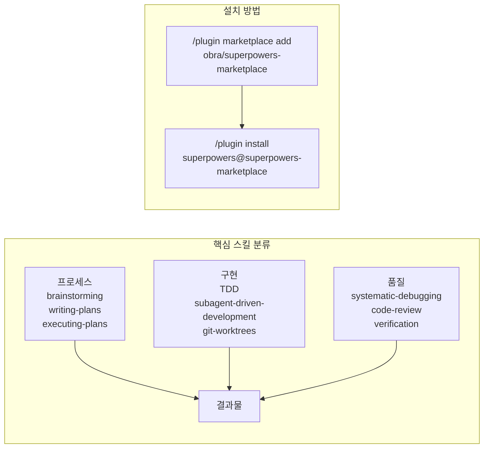

# Superpowers 가이드

> Claude Code를 시니어 개발자 수준의 체계적 워크플로우로 변환하는 스킬 프레임워크

---

## 개요 (사람용 다이어그램)





---

## 상세 내용

### Superpowers 란

Superpowers는 Jesse Vincent(obra)가 만든 **Claude Code용 에이전트 개발 워크플로우 프레임워크**다. 조합 가능한 스킬과 자동 트리거 지침으로 구성되어 있으며, 2026년 1월 15일 **Anthropic 공식 마켓플레이스**에 등록되었다.

핵심 철학:
- 코드 작성 전 반드시 계획 수립
- TDD(테스트 주도 개발) 필수
- 체계적 디버깅 (추측 금지)
- 복잡성 최소화
- 증거 기반 검증

---

### 설치 방법

#### Claude Code (공식 마켓플레이스)

```bash
/plugin marketplace add obra/superpowers-marketplace
/plugin install superpowers@superpowers-marketplace
```

#### npx skills (대안)

```bash
npx skills add https://github.com/obra/superpowers --skill using-superpowers
```

#### Cursor

```bash
/plugin-add superpowers
```

---

### 7단계 핵심 워크플로우

| 단계 | 스킬 | 역할 |
|------|------|------|
| 1 | **brainstorming** | 코드 작성 전 요구사항 정제, 설계 검토, 문서 저장 |
| 2 | **using-git-worktrees** | 격리된 작업 브랜치 생성, 기준선 확인 |
| 3 | **writing-plans** | 2~5분 단위 세부 작업 계획 수립 |
| 4 | **subagent-driven-development** | 병렬 에이전트 작업, 2단계 검토 |
| 5 | **test-driven-development** | RED → GREEN → REFACTOR 순환 |
| 6 | **requesting-code-review** | 심각도별 피드백 검토 |
| 7 | **finishing-a-development-branch** | PR 또는 병합 결정 및 정리 |

---

### 스킬 전체 목록

#### 프로세스 스킬

| 스킬 | 설명 |
|------|------|
| `using-superpowers` | 메타 스킬. 작업 전 관련 스킬을 반드시 확인하도록 강제 |
| `brainstorming` | 구현 전 아이디어 정제, 대안 탐색, 설계 문서 저장 |
| `writing-plans` | 2~5분 단위 실행 가능한 세부 계획 작성 |
| `executing-plans` | 계획 단계별 실행 및 진행 추적 |
| `dispatching-parallel-agents` | 독립 작업을 병렬 서브에이전트에 위임 |

#### 구현 스킬

| 스킬 | 설명 |
|------|------|
| `test-driven-development` | RED(실패 테스트 작성) → GREEN(최소 코드) → REFACTOR 강제 |
| `subagent-driven-development` | 서브에이전트 기반 병렬 구현 + 2단계 검토 |
| `using-git-worktrees` | 작업별 격리된 Git worktree 생성 |
| `writing-skills` | 새 스킬 작성 방법 가이드 |

#### 품질 스킬

| 스킬 | 설명 |
|------|------|
| `systematic-debugging` | 4단계 근본 원인 분석. 무작위 print 디버깅 금지 |
| `verification-before-completion` | 완료 전 검증 체크리스트 실행 |
| `requesting-code-review` | 심각도별(blocker/major/minor) 코드 리뷰 요청 |
| `receiving-code-review` | 리뷰 피드백 처리 방법 |
| `finishing-a-development-branch` | 브랜치 병합/PR 결정 및 정리 |

---

### using-superpowers: 메타 스킬의 핵심

using-superpowers는 **모든 스킬이 올바르게 사용되도록 강제하는 메타 스킬**이다.

핵심 원칙:
```
"IF A SKILL APPLIES TO YOUR TASK, YOU DO NOT HAVE A CHOICE. YOU MUST USE IT."
(스킬이 해당 작업에 적용된다면, 선택의 여지가 없다. 반드시 사용해야 한다.)
```

금지된 합리화 패턴:
| 합리화 | 실제 의미 |
|--------|---------|
| "이건 단순한 질문이야" | 질문도 스킬 확인이 필요한 작업이다 |
| "먼저 정보를 수집할게" | 스킬이 정보 수집 방법을 안내한다 |
| "이 스킬 내용을 기억해" | 항상 현재 버전을 읽어야 한다 |

스킬 우선순위:
1. **프로세스 스킬 우선** (brainstorming, debugging)
2. **구현 스킬 다음** (frontend-design, mcp-builder 등)

---

### test-driven-development 스킬 동작

```
1. 실패하는 테스트 작성 (RED)
   └─ 테스트가 실패하는 것을 직접 확인

2. 최소한의 코드 작성 (GREEN)
   └─ 테스트를 통과시키는 가장 작은 코드만

3. 코드 정리 (REFACTOR)
   └─ 테스트 통과 상태 유지하며 개선

4. 커밋
   └─ 각 RED-GREEN-REFACTOR 사이클 후 커밋
```

> 코드를 먼저 작성하려 하면 스킬이 코드를 삭제하고 처음부터 다시 시작하도록 강제한다.

---

### systematic-debugging 스킬 동작

```
Phase 1: 관찰  → 증상 수집, 로그 분석
Phase 2: 가설  → 근본 원인 후보 목록 작성
Phase 3: 검증  → 가설을 하나씩 실험으로 검증
Phase 4: 해결  → 근거 있는 수정 적용
```

> 추측성 print 디버깅이나 랜덤한 코드 변경 금지.

---

### superpowers-skills (커뮤니티)

`obra/superpowers-skills`는 커뮤니티 기여 스킬 저장소였으나 현재 **아카이브(읽기 전용)** 상태다. 설치 시 `~/.config/superpowers/skills/`에 자동 복제된다.

```
~/.config/superpowers/skills/
├── brainstorming.md
├── test-driven-development.md
├── systematic-debugging.md
└── ...
```

---

### superpowers vs 기본 Claude Code 비교

| 항목 | 기본 Claude Code | Superpowers |
|------|-----------------|-------------|
| 계획 수립 | 없음 (바로 구현) | brainstorming → plan 필수 |
| 테스트 | 선택적 | TDD RED-GREEN-REFACTOR 강제 |
| 디버깅 | 임의 방식 | 4단계 근본 원인 분석 |
| 병렬 작업 | 수동 | 서브에이전트 자동 위임 |
| 코드 리뷰 | 없음 | 심각도별 리뷰 게이트 |
| 브랜치 관리 | 수동 | Git worktree 자동 격리 |

---

## AI 참조용 요약

TOPIC: obra/superpowers - Claude Code Agentic Skills Framework
CATEGORY: workflow, skills, development-methodology

KEY_FACTS:
- Superpowers는 Jesse Vincent(obra)가 만든 Claude Code용 에이전트 개발 워크플로우 프레임워크다
- 2026년 1월 15일 Anthropic 공식 마켓플레이스에 등록되었다
- Claude Code, Cursor, Codex, OpenCode 등 지원
- MIT 라이선스, 무료 오픈소스

INSTALLATION:
- Claude Code: /plugin marketplace add obra/superpowers-marketplace 후 /plugin install superpowers@superpowers-marketplace
- npx: npx skills add https://github.com/obra/superpowers --skill using-superpowers

CORE_WORKFLOW_7STEPS:
1. brainstorming: 코드 작성 전 요구사항 정제 및 설계 검토
2. using-git-worktrees: 격리된 작업 브랜치 생성
3. writing-plans: 2~5분 단위 세부 계획 수립
4. subagent-driven-development: 병렬 에이전트 작업
5. test-driven-development: RED → GREEN → REFACTOR 순환
6. requesting-code-review: 심각도별 피드백 검토
7. finishing-a-development-branch: PR 또는 병합 결정

SKILLS_LIST:
- using-superpowers: 메타 스킬, 스킬 사용 강제
- brainstorming: 구현 전 설계 검토
- writing-plans: 세부 계획 작성
- executing-plans: 계획 실행
- dispatching-parallel-agents: 병렬 에이전트 위임
- test-driven-development: TDD 강제
- subagent-driven-development: 서브에이전트 기반 구현
- using-git-worktrees: Git worktree 격리
- systematic-debugging: 4단계 근본 원인 분석
- verification-before-completion: 완료 전 검증
- requesting-code-review: 코드 리뷰 요청
- receiving-code-review: 리뷰 피드백 처리
- finishing-a-development-branch: 브랜치 마무리
- writing-skills: 새 스킬 작성

COMMUNITY:
- obra/superpowers-skills: 커뮤니티 스킬 저장소 (현재 아카이브)
- obra/superpowers-lab: 실험적 스킬 저장소
- 설치 위치: ~/.config/superpowers/skills/

REFERENCES:
- https://github.com/obra/superpowers
- https://github.com/obra/superpowers-skills
- https://skills.sh/obra/superpowers/using-superpowers
- https://blog.fsck.com/2025/10/09/superpowers/
