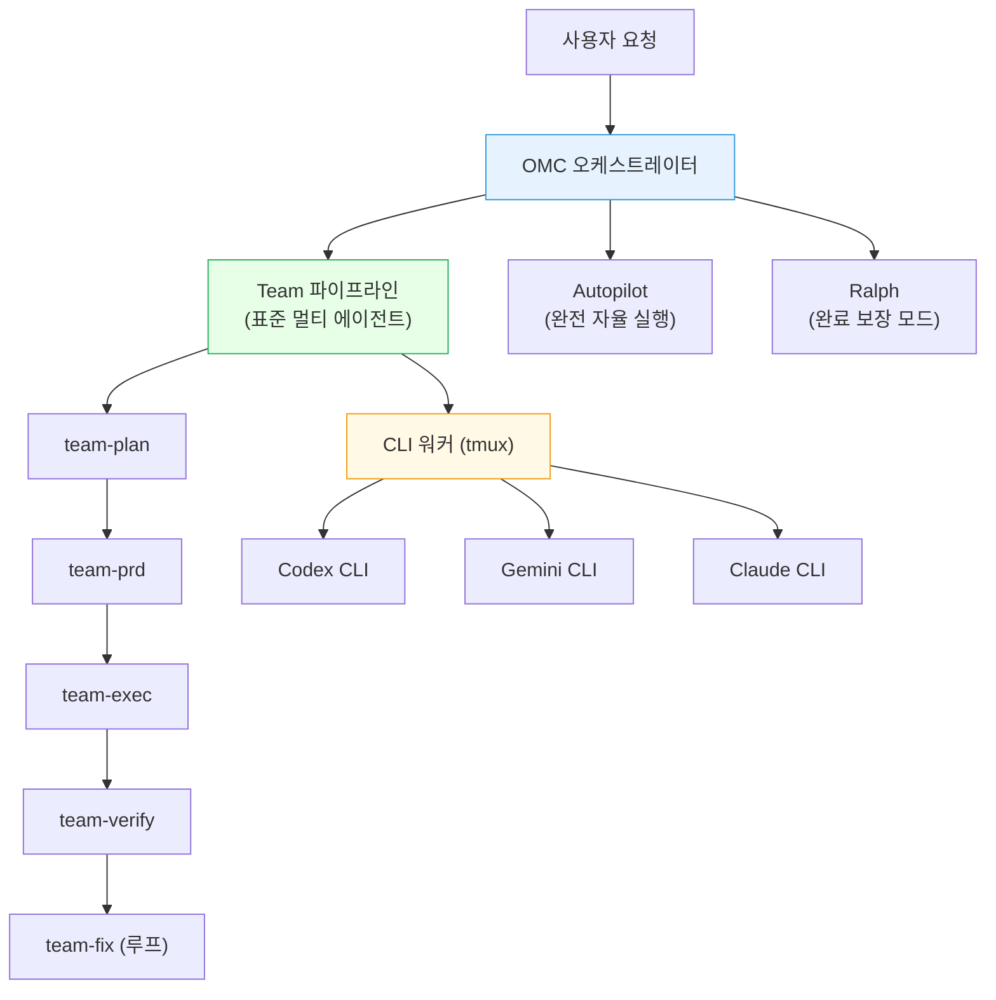

# oh-my-claudecode (OMC) 가이드

> Claude Code를 멀티 에이전트 오케스트레이션 레이어로 확장하는 프레임워크
> GitHub: [Yeachan-Heo/oh-my-claudecode](https://github.com/Yeachan-Heo/oh-my-claudecode)

---

## 개요



---

## 빠른 시작

> 커뮤니티(Zenn, Qiita, ROBOCO)에서 검증된 진입 경로다. 처음 쓴다면 이 순서대로만 해도 충분하다.

### Step 1 — 요구사항 명확화

```
deep interview "만들고 싶은 것 설명"
```

모호한 아이디어를 소크라테스식 질문으로 구체화한다. 모호성을 크게 줄여준다.

### Step 2 — 계획 합의

```
ralplan 기능명 또는 작업 설명
```

실행 전 방향을 정렬한다. 잘못된 방향으로 한 시간 달리는 것을 막는다.

### Step 3 — 자율 실행

```
autopilot: [구체적 작업 설명]
```

자리를 비워도 된다. 완료까지 자율 실행한다.

### Step 4 — 검증 루프

```
ulw 에러 전부 수정
```

또는

```
/ultraqa
```

빌드→린트→테스트→수정을 반복하며 완료 상태를 만든다.

---

## 설치

> **로컬 설치 권장** — 마켓플레이스 방식은 플러그인 캐시 경로에 설치되어 버전 관리가 어렵다. 프로젝트 단위로 `.claude/` 아래에 직접 관리하는 로컬 방식을 권장한다.

### 로컬 설치 구조 (권장)

```
<프로젝트 루트>/
├── .claude/
│   ├── CLAUDE.md                   # OMC 주입 위치 (<!-- OMC:START --> ~ <!-- OMC:END -->)
│   ├── settings.json
│   └── skills/                     # 프로젝트 로컬 커스텀 스킬
│       ├── omc-reference/          # OMC 에이전트/도구 레퍼런스 (자동 로드)
│       └── ...                     # 프로젝트별 커스텀 스킬 추가
└── .omc/                           # OMC 상태 저장소 (자동 생성)
    ├── project-memory.json         # 프로젝트 스캔 결과
    ├── state/                      # 실행 상태
    └── sessions/                   # 세션별 기록
```

로컬 설치는 `omc-setup` 실행 시 위 구조가 자동 생성된다. `.claude/skills/`를 git에 포함시키면 팀 전체가 동일한 스킬을 공유할 수 있다.

### 마켓플레이스 방식 설치 (비권장 — 참고용)

```bash
# 1. 마켓플레이스에 추가
/plugin marketplace add https://github.com/Yeachan-Heo/oh-my-claudecode

# 2. 설치
/plugin install oh-my-claudecode

# 3. 셋업 (CLAUDE.md에 OMC 블록 주입)
/omc-setup
```

### 업데이트

```bash
/plugin marketplace update omc
/omc-setup
```

### 문제 진단

```bash
/omc-doctor
```

### ⚠️ 설치 시 주의사항 (커뮤니티 실사용 기반)

GitHub 이슈 2,600건 분석에서 공통으로 발견된 4대 함정이다.

| 함정 | 증상 | 대처 |
|------|------|------|
| **설치 경로 혼란** | npm 패키지(`oh-my-claude-sisyphus`)와 plugin marketplace 중 어느 것으로 설치해야 하는지 헷갈림 | 로컬 방식(위 권장 구조) 사용. npm은 CLI 도구용, plugin은 Claude Code 통합용 |
| **HUD 빌드 실패** | "HUD not built" 에러 | `/omc-doctor` 실행 후 `/omc-setup` 재실행 |
| **설정 덮어쓰기** | 업데이트 후 `settings.json` 또는 `CLAUDE.md` 커스텀 내용 소실 | 업데이트 전 백업. `.claude/settings.local.json`에 로컬 설정 분리 |
| **`/team` vs `omc team` 혼란** | 명령어가 두 종류라 어떤 걸 써야 할지 모름 | `/team` = Claude Code 인세션 팀, `omc team` = tmux CLI 워커(Codex/Gemini 필요) |

---

## 핵심 실행 모드

> **처음엔 3개만 써도 충분하다.** 커뮤니티 공통으로 `ralplan`, `autopilot`, `ulw` 이 3개가 가장 많이 사용된다. 나머지는 익숙해진 후 점진적으로 추가하면 된다.

| 모드 | 키워드 | 용도 | 우선순위 |
|------|--------|------|---------|
| **Ralplan** | `ralplan ...` | 반복적 계획 합의, 실행 전 방향 정렬 | ★ 먼저 |
| **Autopilot** | `autopilot: ...` | 완전 자율 end-to-end 개발 | ★ 먼저 |
| **Ultrawork** | `ulw ...` | 최대 병렬 리팩토링·에러 수정 | ★ 먼저 |
| **Ralph** | `ralph: ...` | 완료 보장 지속 모드 (ultrawork 포함) | 익숙해지면 |
| **Deep Interview** | `deep interview "..."` | 소크라테스식 요구사항 명확화 | 익숙해지면 |
| **Team** | `/team N:executor "..."` | 단계별 파이프라인, 멀티 Claude 에이전트 | 익숙해지면 |
| **CCG** | `/ccg ...` | Codex + Gemini + Claude 트라이 모델 | 파워유저 |

> `ralph`는 `ultrawork`를 포함한다. 둘을 따로 조합할 필요 없다.

---

## Team 모드 — Claude + Codex + Gemini

### 사전 요구사항

```bash
# Codex CLI 설치 (omc team :codex 사용 시 필요)
npm install -g @openai/codex

# Gemini CLI 설치 (omc team :gemini 사용 시 필요)
npm install -g @google/gemini-cli

# tmux 필요 (CLI 워커 모드)
brew install tmux
```

`~/.claude/settings.json`에 팀 기능 활성화:

```json
{
  "env": {
    "CLAUDE_CODE_EXPERIMENTAL_AGENT_TEAMS": "1"
  }
}
```

### Claude 에이전트 팀 (네이티브 — tmux 불필요)

```bash
# N명의 executor 에이전트로 작업 분산
/team 3:executor "TypeScript 오류 전부 수정"

# 특정 에이전트 지정
/team 2:architect "인증 모듈 설계 검토"
/team 1:security-reviewer "보안 취약점 분석"
```

Team 파이프라인 순서: `team-plan → team-prd → team-exec → team-verify → team-fix`

### CLI 워커 팀 (tmux 기반 — Codex/Gemini 병용)

```bash
# Codex 워커 N개 실행 (코드 리뷰, 보안 분석)
omc team 2:codex "인증 모듈 보안 리뷰"

# Gemini 워커 N개 실행 (UI/UX, 문서, 대용량 컨텍스트)
omc team 2:gemini "UI 컴포넌트 접근성 검토"

# Claude CLI 워커
omc team 1:claude "결제 플로우 구현"

# 상태 확인 / 종료
omc team status <세션명>
omc team shutdown <세션명>
```

### CCG — 트라이 모델 동시 실행 (파워유저)

Codex(코드리뷰/아키텍처) + Gemini(디자인/UI) → Claude(통합)

```bash
/ccg 이 PR 리뷰해줘 — 아키텍처(Codex)와 UI 컴포넌트(Gemini) 관점으로
```

| 워커 | 최적 용도 |
|------|-----------|
| `codex` | 코드 리뷰, 보안 분석, 아키텍처 검증 |
| `gemini` | UI/UX 디자인, 문서, 대용량 컨텍스트 |
| `claude` | 일반 구현, 통합 작업 |

---

## 에이전트 카탈로그

모델 라우팅 원칙: `haiku`(빠른 조회) → `sonnet`(표준) → `opus`(아키텍처/고위험)

| 에이전트 | 모델 | 용도 |
|----------|------|------|
| `explore` | haiku | 코드베이스 빠른 탐색 |
| `analyst` | opus | 요구사항 분석, 숨겨진 제약 발견 |
| `planner` | opus | 실행 계획 수립 |
| `architect` | opus | 시스템 설계, 장기 트레이드오프 |
| `executor` | sonnet | 구현, 리팩토링 |
| `debugger` | sonnet | 근본 원인 분석 |
| `verifier` | sonnet | 완료 검증 |
| `security-reviewer` | sonnet | 보안 취약점 검토 |
| `code-reviewer` | opus | 종합 코드 리뷰 |
| `test-engineer` | sonnet | 테스트 전략 |
| `designer` | sonnet | UX/인터랙션 설계 |
| `document-specialist` | sonnet | SDK/API 문서 조회 |
| `git-master` | sonnet | 커밋 전략, 히스토리 관리 |
| `critic` | opus | 계획/설계 검토 및 도전 |

---

## 커스텀 스킬 (프로젝트 로컬)

한 번 해결한 패턴을 재사용 가능한 스킬로 저장. `.claude/skills/`를 git에 포함하면 팀 전체가 공유한다.

```yaml
# .claude/skills/my-skill/SKILL.md
---
name: my-skill
description: 언제 이 스킬을 사용할지 설명
triggers: ["키워드1", "키워드2"]
---

스킬 내용...
```

| 경로 | 적용 범위 |
|------|-----------|
| `.claude/skills/` | 해당 프로젝트만 (팀 공유 가능, git 관리) |
| `~/.claude/skills/` | 모든 프로젝트 |
| `.omc/skills/` | OMC 전용 스킬 |

```bash
/skill list
/skill add
/skill search "키워드"
/learner   # 세션에서 패턴 자동 추출 → 스킬로 저장
```

---

## 다른 도구와 비교

OMC를 선택하기 전에 다른 도구와 비교한다. 철학이 다르므로 상황에 맞게 선택한다.

| 도구 | 철학 | 선택 기준 |
|------|------|-----------|
| **OMC** | 화력 극대화, 완료까지 멈추지 않음 | 자율성·속도 우선, Claude에 올인 |
| **Superpowers** | 체크포인트 기반 단계 통제 | 각 단계를 직접 통제하고 싶을 때 |
| **TAKT** | LLM 독립성, Provider 추상화 | Claude 외 다른 LLM도 병용할 때 |

> Zenn 비교 분석(2026-03-31) 기준: "OMC는 무기, Superpowers는 공정 관리"

---

## 유틸리티

### Rate Limit 자동 대기

장시간 작업 시 토큰 한도 초과로 멈추는 문제를 자동 처리한다. tmux 필요.

```bash
omc wait           # 상태 확인
omc wait --start   # 자동 재개 데몬 활성화
omc wait --stop    # 데몬 비활성화
```

### 알림 설정 (Telegram/Discord/Slack)

`autopilot`/`ralph` 실행 후 완료 알림을 받는다.

```bash
omc config-stop-callback telegram --enable --token <token> --chat <chat_id>
omc config-stop-callback discord --enable --webhook <url>
omc config-stop-callback slack --enable --webhook <url>
```

### OMC 상태 경로

```
.omc/state/              # 실행 상태
.omc/notepad.md          # 임시 메모
.omc/project-memory.json # 프로젝트 스캔 결과
.omc/plans/              # 계획 파일
.omc/research/           # 조사 결과
```

### 킬 스위치

```bash
DISABLE_OMC=1 claude                    # OMC 전체 비활성화
OMC_SKIP_HOOKS=hook1,hook2 claude       # 특정 훅만 스킵
```

---

## 관련 링크

- [GitHub](https://github.com/Yeachan-Heo/oh-my-claudecode)
- [공식 문서](https://yeachan-heo.github.io/oh-my-claudecode-website)
- [CLI 레퍼런스](https://yeachan-heo.github.io/oh-my-claudecode-website/docs.html#cli-reference)
- [마이그레이션 가이드](https://yeachan-heo.github.io/oh-my-claudecode-website/docs/MIGRATION.md)
- npm 패키지명: `oh-my-claude-sisyphus`
